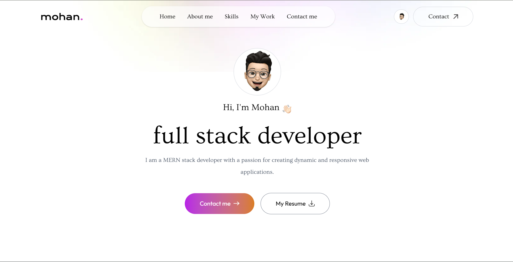
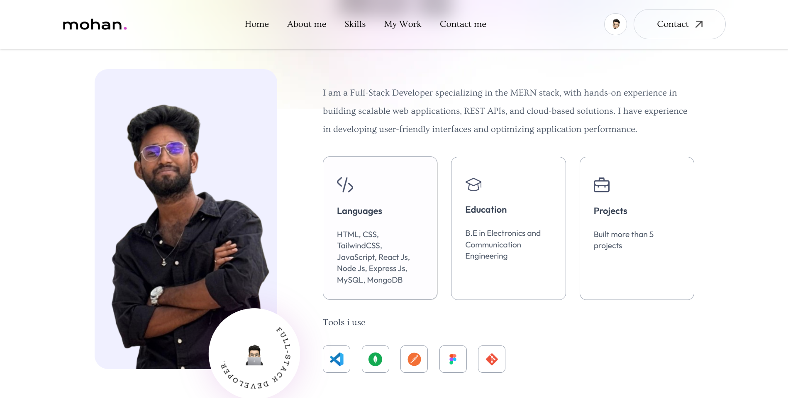
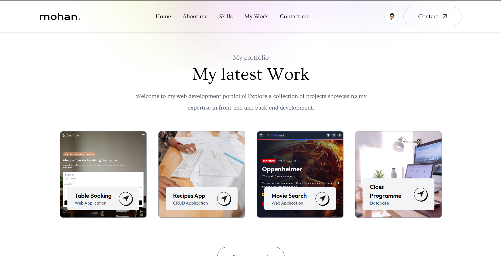
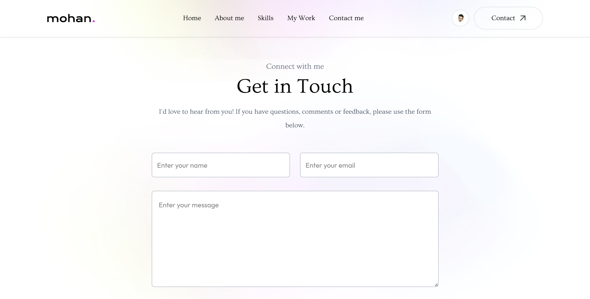

# 🌐 Mohan S G - Portfolio

This is my personal **Portfolio Website** built with **HTML, TailwindCSS, and JavaScript**.  
It showcases my skills, projects, certificates, and contact details in a clean, responsive design.

---

## 🔗 Live Demo
👉🏻 [View Portfolio](https://your-portfolio-link.netlify.app/)  

---

## 🚀 Features
-  **Modern UI/UX** with TailwindCSS  
-  **Fully Responsive** (mobile, tablet, desktop)  
-  **About Me** section with skills, education, and tools  
-  **Certificates** section linked with Google Drive  
-  **Projects Showcase** with live links and GitHub repos  
-  **Contact Form** with email placeholder  
-  Smooth animations and hover effects  

---

## 🛠️ Tech Stack
- **HTML5**
- **TailwindCSS**
- **JavaScript**
- **Google Fonts (Outfit & Ovo)**
- **Responsive Design**

---

## 📷 Preview





---

## 📂 Project Structure
├── public/
│ ├── logo.png
│ ├── profile.jpg
│ ├── header-bg-color.png
│ ├── work-1.png
│ ├── work-2.png
│ ├── work-3.png
│ ├── work-4.png
│ └── (icons, certificates, tools, etc.)
├── index.html
├── script.js
└── README.md


---

## 📬 Contact
- Email: **sgmohan.dev@gmail.com**  
- Instagram: [__sree_46__](https://instagram.com/__sree_46__)  
- GitHub: [SGMohan](https://github.com/SGMohan)  
- LinkedIn: [Mohan S G](https://linkedin.com/in/mohan-s-g-70a182310)  

---

## ⚡ Setup & Usage
Clone the repository:
```bash
git clone https://github.com/SGMohan/portfolio.git
cd portfolio
```

Run with Live Server or simply open index.html in your browser.

📜 License

© 2025 Mohan S G. All rights reserved.
